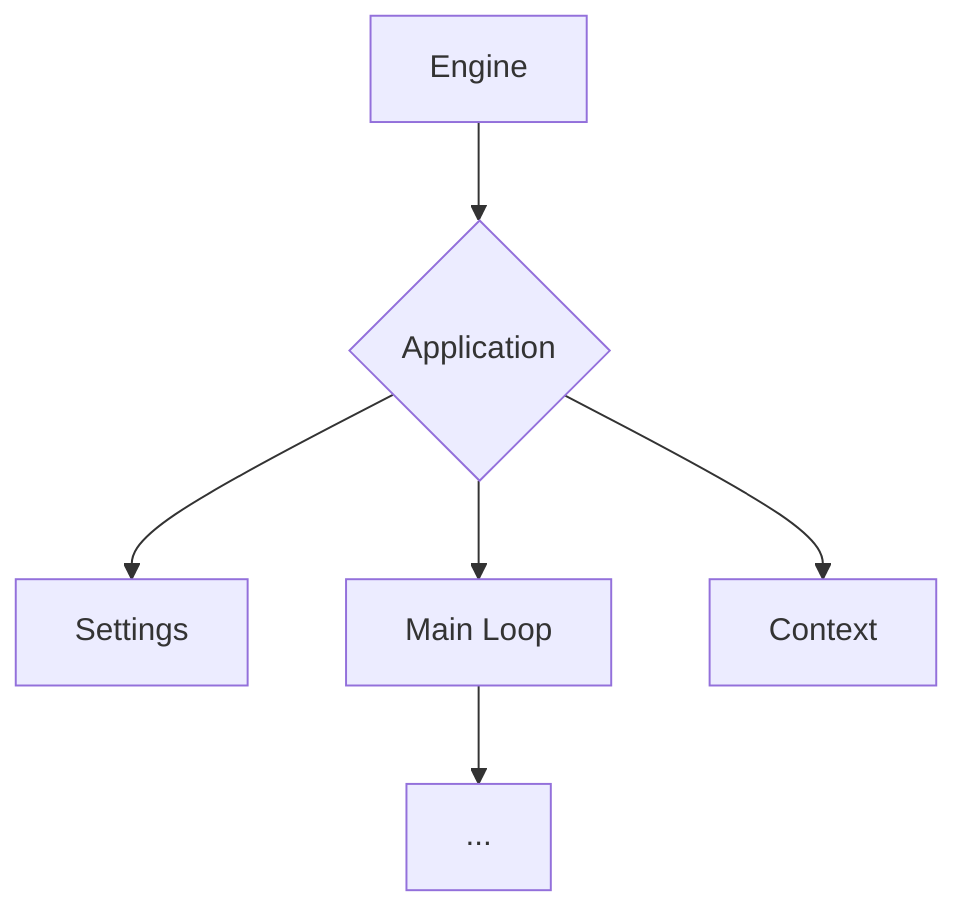
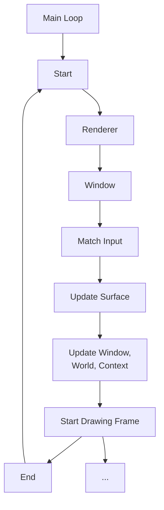
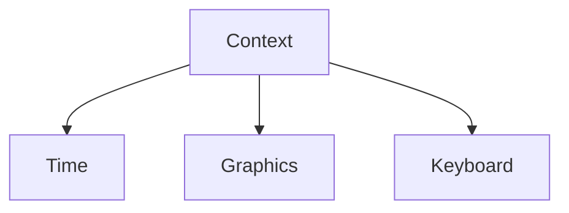
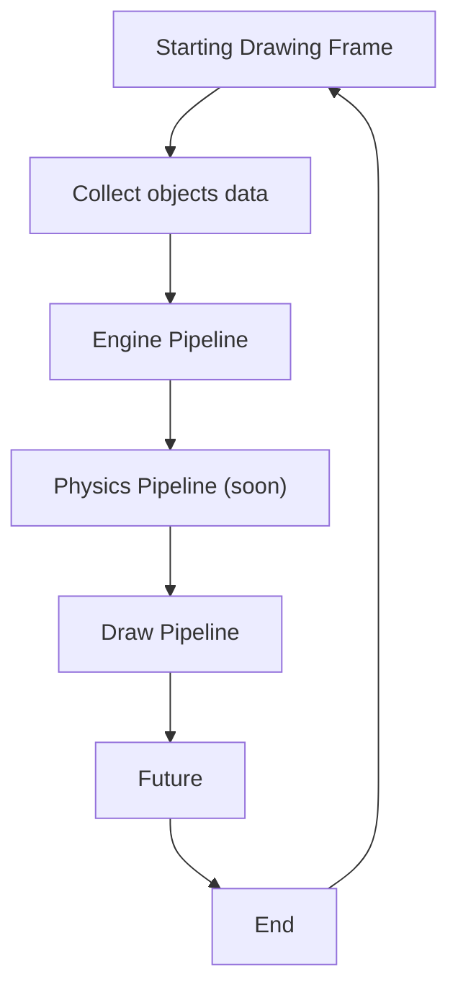

<h1 align="center">Delfi Engine</h1>

Simple physics engine. Current version: v0.0.20

Dependencies:
1) [Rust](https://www.rust-lang.org/tools/install)
2) [Ninja Build](https://ninja-build.org)

Controls:
WASD - movement;
F11 - Full Screen;
M - Maximize window;
LShift + Esc - exit;

Current Engine structure (Graph):

How Main Loop works:

Context System:

How Render Loop works (Graph):

TODO:
1. [x] Code refactoring;
2. [x] Create Context system;
3. [x] Create simple *Render loop*;
4. [ ] Create world update and draw logic;