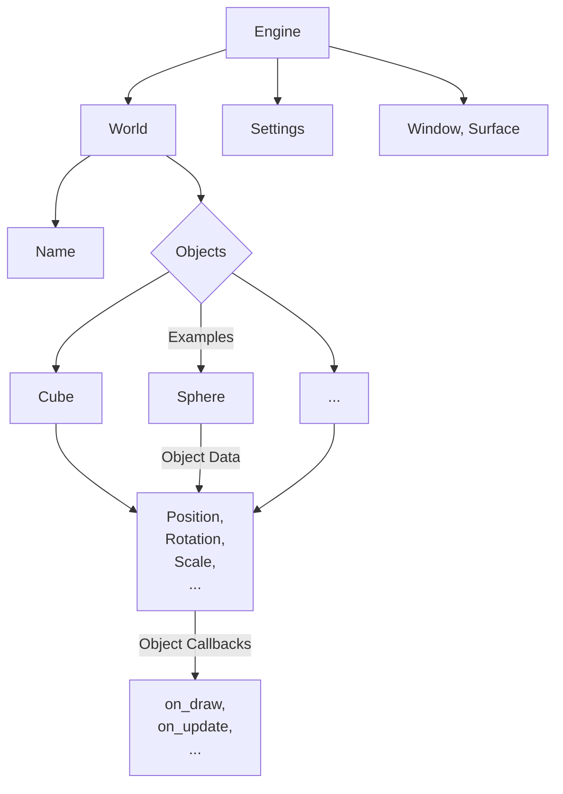
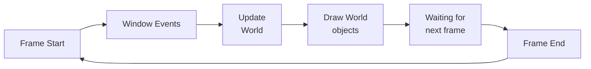

<h1 align="center">Delfi Engine</h1>

Simple physics engine. Current version: v0.0.15

Current Engine structure (Graph):

How Render Loop works (Graph):

TODO:
1. [x] Engine, World struct;
2. [x] Simple Object trait;
3. [x] Window drawing;
4. [ ] Code refactoring;