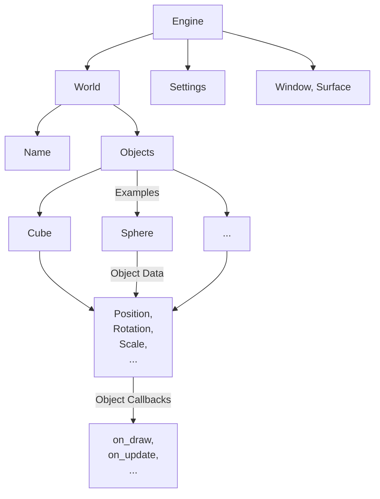

<h1 align="center">Delfi Engine</h1>

Simple physics engine. Current version: v0.0.13

Current Engine structure:

TODO:
1. [x] Engine, World struct;
2. [x] Simple Object trait;
3. [x] Window drawing;
4. [ ] Create base drawing logic;
5. [ ] Create base physics logic;